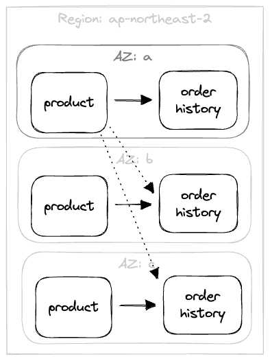
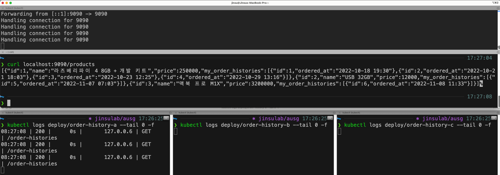
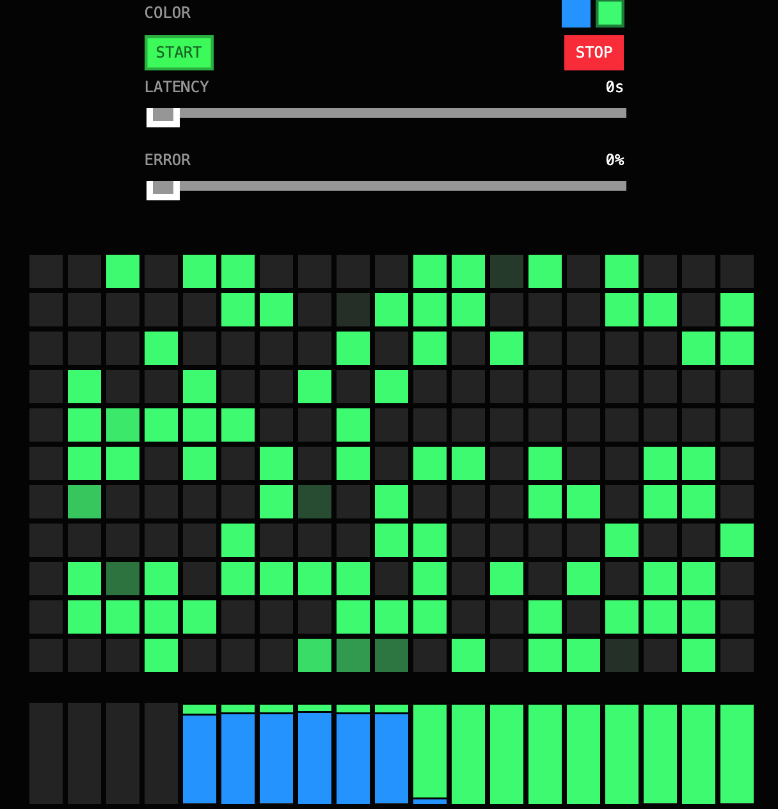

# istio-traffic-management-presentation

* AUSG(동아리)에서 2022/11/14에 진행한 발표 자료
* Istio를 이용해 트래픽을 관리하는 방법을 간단히 살펴봄
* 목표: **"대학생 동아리임을 감안하여 깊은 내용보단 서비스 메쉬와 Istio에 대해 간단히 설명하고, Istio에 대한 흥미를 유발하며 새로운 자극이 될 수 있도록 하기"**
* Demo는 single region, multi az의 개인 클러스터에서 진행
  * Kubernetes: 1.24
  * Istio: 1.15

## PDF 빌드 방법

```console
$ cd presentation

$ marp --pdf --html presentation.md --allow-local-files
```

* marp를 이용해 프레젠테이션 파일을 만듦.
* 중간 중간 `html`을 쓰는 곳이 있어서 `--html` 인자 추가해줘야함.
* pdf가 범용성이 좋아서 pdf로 렌더함.

## Demo #1. Locality load balancing



* 서버 <-> 서버가 통신할 때 지역성을 살려 로드밸런싱하며 통신.
* AZ a의 서버는 AZ a의 서버와 통신한다.
* product 서버에 상품 조회 요청이 들어온 경우 product 서버는 "유저가 해당 제품을 주문한 적이 있는가?"를 조회하기 위해 order-history 서버에게 요청을 보낸다.
  * 이것이 서버 간 통신 (Service to Service)
  * 요청 예시
    


### Demo #1) How to build and deploy

```console
# Build
docker build . --platform linux/amd64 -t umi0410/istio-demo-ausg:v1
```

```console
# Push
docker push umi0410/istio-demo-ausg:v1
```

```console
# Deploy
kubectl apply -n ausg -f k8s/namespace.yaml -f k8s/product/ -f k8s/order-history
```

## Demo #2. Canary Deployment


* container image tag를 `:blue` -> `:green`으로 변경하는 배포를 Canary 방식으로 안전하게 수행
* DestinationRule을 통해 stable subset 과 canary subset을 정의
* VirtualService를 통해 canary subset의 weight를 늘렸다 줄였다 가능
* 이미지는 canary 배포를 통한 트래픽 비율을 한눈에 확인할 수 있는 [ArgoRollout의 demo 이미지](https://hub.docker.com/r/argoproj/rollouts-demo/tags)를 이용함 

## Demo #2) How to deploy

```console
kubectl apply -n ausg -f k8s/namespace.yaml -f k8s/canary-deployment
```

## 참고한 자료

* 각종 Istio의 공식 문서들
* Istio in Action (2022.03) - https://www.manning.com/books/istio-in-action
* Circuit breaker in microservice - https://blog.devgenius.io/circuit-breakers-in-microservices-625654df0830
* ArgoRollout 공식 문서 - https://argoproj.github.io/argo-rollouts/
* Service Mesh 구현체들 비교 - https://devopscube.com/service-mesh-tools/
* Service Mesh Manifesto - https://buoyant.io/service-mesh-manifesto
* Linkerd가 Envoy를 proxy로서 사용하지 않은 이유 - https://linkerd.io/2020/12/03/why-linkerd-doesnt-use-envoy