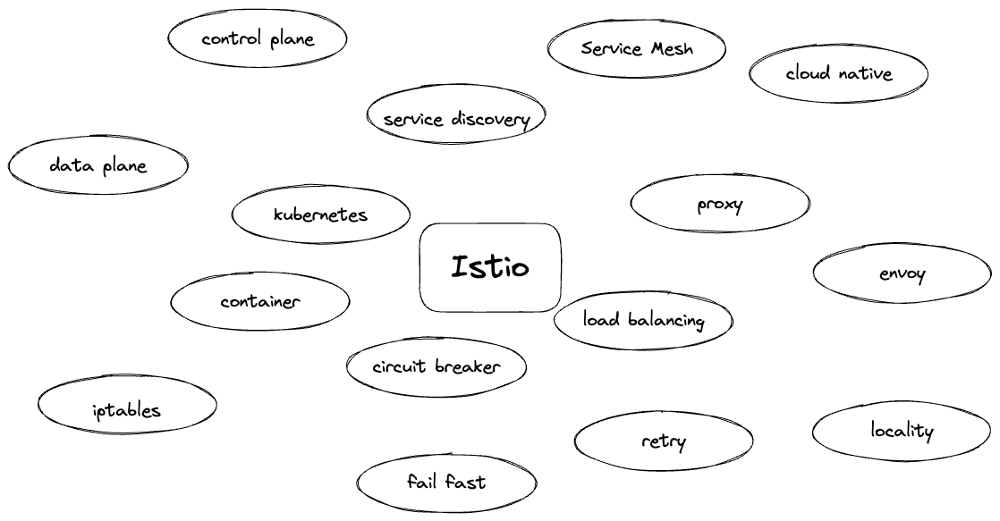
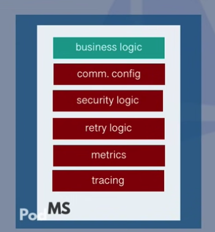
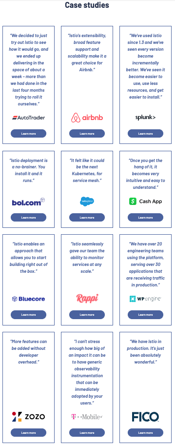
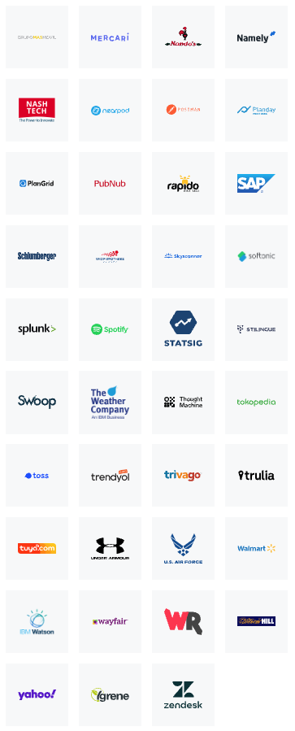
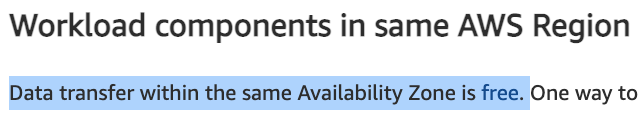

<style>
section {}

img[alt~="center"] {
  display: block;
  margin: 0 auto;
}

div[data-marpit-advanced-background-container~="true"]{
  background-color: white !important;
}

.data-marpit-advanced-background-container[alt~="color:primary"] {
  background-color: #333333;
}

section pre {
    color: black;
}

ul.small > li, ol.small > li{
    font-size: 20pt
}

section.light footer {
  color: #DDDDDD;
}
section a:link,
section a:visited,
section a:hover,
section a:active,
section.light footer a:link, 
section.light footer a:visited, 
section.light footer a:hover, 
section.light footer a:active{
  color: #DDDDDD;
  text-decoration: underline;
}

section footer a:link, 
section footer a:visited, 
section footer a:hover, 
section footer a:active{
  color: #555555;
  text-decoration: underline;
}
</style>


# Istio를 이용한 트래픽 관리

##### 박진수

2022.11.14 AUSG 정기모임

---

# 제 소개


* 경희대학교 화학공학과 -> 컴퓨터공학과
* 메가존 클라우드, 당근마켓 인턴을 거쳐 
  데브시스터즈에서 데브옵스 엔지니어로 근무 중 💼
* 트러블슈팅을 좋아합니다
* 깊게 파고들고 싶습니다...
</br></br>
<ul class="small">
  <li> 💌 dev.umijs@gmail.com </li>
  <li> 🏠 <a href="https://umi0410.github.io">https://umi0410.github.io</a></li>
  <li>Github: <a href="https://github.com/umi0410">@umi0410</a></li>
</ul>

---

# 오늘 다뤄볼 내용

* Service Mesh란?
* Istio란?
* Istio의 주요 개념 설명, 트래픽 관리 예시 살펴보기
* 라이브 데모
  * Locality load balancing
  * Canary deployment

---

# 평범한 대학생이 익히기는 쉽지 않은 Istio..



* 많은 기능이 있다해도 보통은 애초에 그런 기능을 왜 쓰는지부터가 공감이 안된다.
  * MSA나 실제 프로덕션을 경험해보기 힘듦.
* 그럼에도 불구하고 한 번 설치나해볼까.. 마음 먹으면
  * Istio: "😎 어이, 쿠버네티스부터 친해지고 돌아와라. ㅋㅋ"

-> "오늘 그냥 구경이나 해보고 관심있으면 나중에 찍먹이라도 해보자"
    Istio나 서비스메쉬, 쿠버네티스가 꼭 익혀야하는 기술은 아님. 삘이 오면 공부해볼만 할 뿐.

---

# Service mesh가 등장하게 된 배경

<div style="text-align: center;">


</div>

<ol class="small">

<li>컨테이너 기술의 보급</li>
<li>Monolith -> MSA로의 전환</li>
<li>마이크로서비스를 사용하고 싶은데 공통 로직을 매번 개발하고 관리하기 너무 번거로워!</li>
<li>공통 로직은 프록시가 공통으로 수행해주고, 애플리케이션은 비즈니스 로직만 담당할래!</li>
    <ul class="small">
    <li> 애플리케이션 코드에는 변경 하나 없이 서비스 메쉬 레벨에서 공통 로직 지원 가능</li>
    </ul>
<li>더 나아가서는 트래픽을 제어하는 다양한 기능들도 지원 가능</li>
e.g.) canary를 위한 load balancing, locality load balancing, traffic mirroring, fault injection, ...
</ul>

---

# 왜 이름이 Service Mesh인가?

서비스 간 통신에서의 다양한 기능을 위해 ~~단일 Gateway~~를 갖는 게 아니라
각 서비스에 **Proxy**가 붙어서 자기들끼리 통신하는 **그물망** 형태이기 때문.

---

# Service Mesh의 아키텍쳐

* Data plane
  * 서비스 - 서비스 간의 요청을 intercept해서 메쉬를 통해 이용하고 싶었던 기능들을 수행해줌.
* Control plane
  * 주로 data plane에게 설정을 전달해주는 역할
  * 필요한 데이터(e.g. 인증서)를 생성하거나 조회해옴.

---

# Istio란?


* 서비스 메쉬를 구현한 제품 중 하나
  * 다른 제품들은 Linkerd, Cilium Service Mesh, Consul Connect, ... 등이 있음.
* Istio에서 Data plane 역할을 하는 것은 Envoy이고, Istio는 Envoy를 어떻게 편리하고 안전하게 사용하게끔 해주는 도구 같은 느낌.

<!-- _footer: External DNS와 Istio 이용하기: https://kubernetes-sigs.github.io/external-dns/v0.13.1/tutorials/istio/ -->

---

# Istio란?

* Istio는 **VirtualService**, **DestinationRule**, Sidecar, AuthorizationPolicy, ServiceRegistry, ... 등등의 Custom Resource로 Envoy의 설정을 추상화시켰음. -> 이용하기 좀 더 편하고 validation이 된다. ^_^
  * 처음엔 일단 VirtualService, DestinationRule에 집중해보는 게 좋고, 세부 기능도 궁금하다면 나머지 개념들을 익혀나가는 게 좋을 듯함.
  * Envoy에 존재하는 Listener, Router, Cluster, Endpoint 등의 개념등을 추상화 한 것

---

<!-- _class: light -->

# Istio를 사용 중이라고 하는 회사 목록





뭐, 다양하게 많은 듯 하다.

<!-- _footer: 출처: https://istio.io/latest/about/case-studies/ -->

---
# 시간 관계 상 초간단하게
# VirtualService와 DestinationRule을
# 살펴만 보겠습니다.
---

#### Custom Resource: VirtualService

```yaml
# https://istio.io/latest/docs/concepts/traffic-management/#virtual-services
apiVersion: networking.istio.io/v1alpha3
kind: VirtualService
metadata:
  name: reviews
spec:
  hosts:
  - reviews
  http:
    route:
    - destination:
        host: reviews
        subset: v2
      weight: 10%
  - route:
    - destination:
        host: reviews
        subset: v1
```

<ul class="small">

<li>"특정 L7 조건을 만족하면 신 버전인 review:v2로, 그게 아니라면  구 버전인 review:v1로 라우팅하라"</li>
<li>"10%는 신 버전인 review:v2로, 나머지는 review:v1으로 라우팅하라"</li>


---

#### Custom Resource: DestinationRule

```yaml
apiVersion: networking.istio.io/v1alpha3
kind: DestinationRule
metadata:
  name: reviews
spec:
  host: reviews
  subsets:
  - name: v1
    labels:
      version: v1
  - name: v2
    labels:
      version: v2
```

* Service Subset이나 로드밸런싱 알고리즘을 정의하는 등 목적지에 대한 세부 설정 가능.

---

# Demo #1: Locality load balancing


* **같은 Availabilty zone에 있는 서버들은 같은 zone에 있는 서버 위주로 통신할 수 있도록 하는 intra zonal locality load balanacing**
* **DestinationRule을 이용**
* `product` 서버는 "해당 상품을 주문한 적이 있는가?"를 조회하기 위해 `order-history` 서버에게 요청을 보냄.
  * 이때 AZ a에 있는 `product` 서버는 AZ a에 있는 `order-history` 서버로 요청을 보냄!
---

# Demo #1: Locality load balancing


* 서버(Pod)가 스케쥴된 노드(VM) 간의 locality를 살려 load balance
* 대부분의 클라우드 프로바이더들은 Node(VM)가 뜨는 지역에 대해 `topology.어쩌구`라는 라벨을 붙여줌.
* 네트워크 데이터 전송 비용 이득
  

<!-- _footer: |
  같은 az내에서는 data transfer이 무료라는 글: https://aws.amazon.com/blogs/architecture/overview-of-data-transfer-costs-for-common-architectures/
-->

---

# Demo #1: Locality load balancing


1. zone a의 product Pod로 요청을 보낸다.
2. zone a의 product Pod는 zone a의 order-history Pod에게만 요청을 보낸다.

---

# Demo #2: Canary deployment


* container image tag를 `:blue` -> `:green`으로 변경하는 배포를 Canary 방식으로 안전하게 수행해볼 것임.
* DestinationRule을 통해 `stable`, `canary`의 2개의 subset을 정의.
  - stable은 <span style="color:#2082E0">blue</span>, canary는 <span style="color:#3DFA70">green</span>으로 응답.
  - 결과적으로는 <span style="color:#3DFA70">green</span> stable이 된다.
- VirtualService를 통해 subset별 weight를 조절할 수 있다.
- 초기 트래픽 비율 - `stable: 100%`, `canary: 0%`
- Cananry 중 - `stable: 90%`, `canary: 10%`
- Canary 완료 - stable이 <span style="color:#2082E0">blue</span> ->  <span style="color:#3DFA70">**green**</span>이 되며 `stable: 100%`, `canary: 0%`

---

# Demo #2: Canary deployment

1. https://canary.jinsu.me 에 접속해 모든 요청이 <span style="color:#2082E0">stable</span>로 전달됨을 확인.
2. VirtualService에서 subset별 weight <span style="color:#2082E0">`stable: 90%`</span>로 낮추고 <span style="color:#3DFA70">`canary: 10%`</span>로 늘림.
3. https://canary.jinsu.me 에서 10%의 요청만  <span style="color:#3DFA70">canary</span>임을 확인.
4. `kubectl edit`을 통해 <span style="color:#2082E0">stable</span>의 image tag도 <span style="color:#3DFA70">green</span>으로 변경.
  이때 <span style="color:#3DFA70">stable</span>과 <span style="color:#3DFA70">canary</span> 모두 <span style="color:#3DFA70">green</span>
5. <span style="color:#2082E0">blue</span> -> <span style="color:#3DFA70">green</span>으로의 canary deployment가 완료되었으니 weight를 다시 `stable: 100%, canary: 0%`로 변경

<!-- _footer: ArgoRollouts와 Istio 이용하기 공식 문서: https://argoproj.github.io/argo-rollouts/getting-started/istio/ -->

---

# 제가 느낀 Istio의 장단점 - 장점 👍

* 새로운 서비스를 노출시킬 때 Istio가 제공하는 API를 바탕으로 간편하게 노출시킬 수 있다.
* 네트워크 트래픽에 대해 다양한 기법을 간편히 적용할 수 있다.
* 다른 클라우드 네이티브한 도구들과 연동이 잘 된다.
  * e.g.) External DNS, Cert Manager, Argo Rollout, Prometheus ...


---

# 제가 느낀 Istio의 장단점 - 단점 🤔

_(단점은 대체로 Istio만의 단점이라기보단 서비스 메쉬의 공통적인 단점 같음.)_

* 알면 편하게 쓸 수 있는데,,, 모르면 너무 어렵고 진입하기 쉽지 않다.
* 관리 난이도가 낮지 않다. 모든 트래픽을 제어할 수 있기 때문에 그만큼 조심스럽다. 릴리즈 주기가 짧다.
* 개발자의 로컬 환경과 실제 클러스터 환경에서의 동작이 상이할 수 있어 때론 경우에 따라 디버깅 난이도가 높아질 수 있다.

---

# 피드백 및 Q&A


<center><i>감사합니다.</i></center>

---

# 참고한 것

* 각종 Istio의 공식 문서들
* Istio in Action (2022.03) - https://www.manning.com/books/istio-in-action
* Circuit breaker in microservice - https://blog.devgenius.io/circuit-breakers-in-microservices-625654df0830
* ArgoRollout 공식 문서 - https://argoproj.github.io/argo-rollouts/
* Service Mesh 구현체들 비교 - https://devopscube.com/service-mesh-tools/
* Service Mesh Manifesto - https://buoyant.io/service-mesh-manifesto
* Linkerd가 Envoy를 proxy로서 사용하지 않은 이유 - https://linkerd.io/2020/12/03/why-linkerd-doesnt-use-envoy
